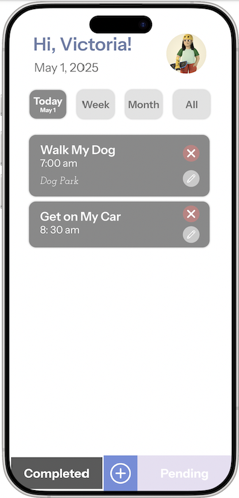

# Personal Task Manager Application

### Author: YI SHI

A simple, beautiful, and efficient personal task manager mobile application, built using **React Native**, **Expo**, and **TypeScript**.  
Designed to help users easily organize their daily, weekly, and monthly tasks with a clean and intuitive interface.

---

## UI Design Images





---

## Features

- **View Tasks**: See tasks filtered by **Today**, **This Week**, **This Month**, or **All**.
- **Switch Between Tabs**: Toggle between **Pending** and **Completed** tasks.
- **Add New Tasks**: Create new tasks with title, date, time, location, color, and content.
- **Edit Tasks**: Update existing task information and change status.
- **Delete Tasks**: Permanently remove tasks with confirmation prompt.
- **Responsive UI**: Optimized for both mobile (iOS/Android) and web view.
- **Animated Avatar**: Random user avatar loaded from the internet.
- **Data Sorting**: Tasks sorted by **date** and then by **time**.
- **Persistent Filtering**: Filtering and tab switching with clean UI/UX.

---

## Tech Stack

- **React Native** (via Expo)
- **TypeScript**
- **Expo Router (Native Stack Navigator)**
- **React Native Gesture Handler**
- **Context API** (for global avatar)
- **React Native DateTimePicker** (for date and time selection)

---

## Project Structure

```
.
├── App.tsx                 # Entry point of the app, setup navigation and context
├── components/
│   └── TaskItem.tsx         # Individual task item component
├── contexts/
│   └── UserContext.tsx      # Provides user avatar context globally
├── data/
│   └── mockTasks.ts         # Mock task data for demo and testing
├── screens/
│   ├── EditTaskScreen.tsx   # Screen for creating/editing tasks
│   └── TaskListScreen.tsx   # Main task listing screen
├── types/
│   └── Task.ts              # Task type definitions
└── package.json             # Project dependencies and scripts
```

---

## Getting Started

Follow these steps to run the project locally.

1. Clone the Repository

```bash
git clone https://github.com/vicshiyi/personal-task-manager.git
cd personal-task-manager
```

2. Install Dependencies
   Make sure you have Node.js and npm installed.

```bash
npm install
```

3. Install Expo CLI (if not installed)

```bash
npm install -g expo-cli
```

4. Run the Application

```bash
npm start
```

This will open the Expo Developer Tools in your browser.
You can then:

- Press 'i' to launch iOS simulator (Mac only)

- Press 'a' to launch Android emulator

- Or scan the QR code with your real device via Expo Go App

---

## Dependencies

| Package                                | Version | Purpose                         |
| :------------------------------------- | :------ | :------------------------------ |
| react-native                           | latest  | Base framework                  |
| expo                                   | latest  | Build and manage RN apps easily |
| @react-navigation/native               | latest  | Navigation container            |
| @react-navigation/native-stack         | latest  | Stack-based navigation          |
| react-native-gesture-handler           | latest  | Gesture handling for RN         |
| @react-native-community/datetimepicker | latest  | Native Date and Time pickers    |
| typescript                             | latest  | Static type checking            |

---

## Screenshots


